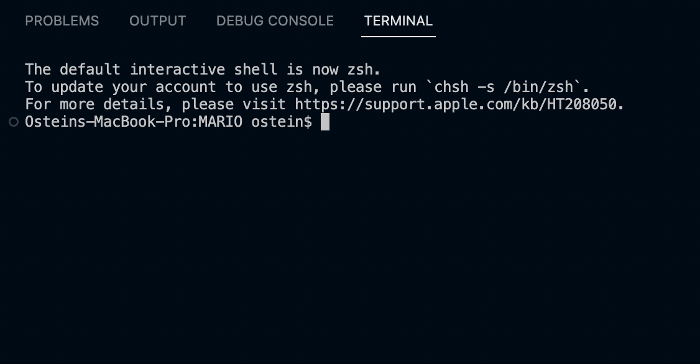

#FSM MARIO
This repository contains a system simulating the video game logic for the character Mario from the Super Mario series written in C language using Finite State Machine.

##Introduction
In the 1985 video game "Super Mario Bros.", you play as the plumber Mario who goes on a quest through the Mushroom Kingdom to save Princess Peach from Bowser the Koopa King. Throughout the game, you traverse through levels by passing through obstacles and stomping on enemies. You can also get power-ups which can help you in the game. The system will be simulating the states Mario will go through after encountering different inputs from the game.

##States
####This system contains four states:
- **Small Mario (State = 00)** = This will be the initial state for the system. After entering the other states, the system will be able to re-enter this state if Mario *takes damage in his big form* or whenever *Mario is revived after he dies*.
- **Big Mario (State = 01)** = The system will enter this state when *Mario encounters a mushroom in his small form*. Should Mario encouter another mushroom, the system will remain in this state. The system can also enter this state if *Mario takes damage in his fire form*.
- **Fire Mario (State = 10)** = The system will enter this state when *Mario encounters a fire flower in both his small and big form*. Should Mario encounter a mushroom or another fire flower, the system will remain in this state.
- **Dead Mario (State = 11)** = The system will enter this state when *Mario encounters an enemy and takes damage in his small form*. Any inputs received in this state will revive Mario and brings him back to his small form.

##Inputs
####This system accepts four inputs:
- **00 = No Input** = This input represents no inputs. Nothing will happen if the system receives this input.
- **01 = Fire Flower** = This input represents the fire flower. Mario will transform into his fire form if he is in his small or big form when the input is received. If the input is received when he is in his fire form, he will remain in that form.
- **10 = Mushroom** = This input represents the mushroom. Mario will transform into his big form if he is in his small form when the input is received. If the input is received when he is in his fire form, he will remain in that form.
- **11 = Enemy/Damage** = This input represents an encountered enemy or damage taken by Mario. If Mario is in his fire form when the system receives this input, Mario will lose his fire powers and go back to his big form. If he is in his big form when the input is received, he will go back to his small form. If Mario is in his small form when he takes damage, he will die.

##Visualization
Attached are media I provided to visualize the system.

###State Diagram

###Truth Table
From the above State Diagram, we can construct a truth table: 

###Karnaugh Map
From the Truth Table above, we can create a Karnaugh Map for all the states and outputs:
#####Karnaugh Map for S0

#####Karnaugh Map for S1

#####Karnaugh Map for o0

#####Karnaughh Map for o1

###Boolean Equations
From the Karnaugh Maps above, we can derive these boolean equations:
-S0 = s0 i1' i2' + s0' i1' i2 + s0' s1' i2 + s1' i1' i2' + s0' i1 i2'
-S1 = s1 i1' i2' + s1' i1 i2 + s0' i1  i2'
-o0 = s0
-o1 = s1

##Running the Code
Below is a video showing the code running.

